# System Overview

The purpose of this system is to collect sequencing and quality control (QC) metrics, both historically and in real time, for the Genome Technologies (GT) production environment at JAX. The collected metrics are stored in a local DuckDB database (GTdashboardMetrics.duckdb, version 1.2.2), which is then pushed to a designated destination server. From there, the data is queried and sliced according to user interactions with the GT Dashboard, enabling dynamic filtering and visualization of relevant metrics.

The codebase supporting this system is primarily written in Bash and R, with some auxiliary logic implemented in Python. The system is designed for internal use by JAX staff and integrates tightly with production pipelines to provide reliable, up-to-date metrics for monitoring sequencing operations and QC performance.

> **Important:**
> Do **not** change permissions for `/srv/shiny-server/.usersProfile.json` and `/srv/shiny-server/log`.
> These files/folders must be owned by `shiny:shiny` set with `chown shiny:shiny` and have permissions `chmod 755` so the Shiny app can read, write, and execute as needed.

---

## Code Location

* On **Elion2**:
  `/gt/research_development/qifa/elion/software/qifa-ops/0.1.0/dashboardCodes`

* On **ctgenometch03**:
  `/srv/shiny-server/`

---

## Metrics Locations

* On **Elion2**:
  `/gt/data/seqdma/GTwebMetricsTables`
  *(Note: Some files/folders may be hidden; use `ls -la` to view)*

* On **ctgenometch03**:
  `/srv/shiny-server/.InputDatabase`
  *(Note: several files are hidden; use `ls -la` to view)*

---

# Code Flow Overview

This diagram shows how the main scripts and modules interact in the Genome Technologies sequencing and QC metrics system.

```mermaid
flowchart TD
  %% Define font style class
  classDef bigText fill:white,stroke:black,font-size:50px;

  %% Crawlers
  A1[🛠 crawlerSeqMetrics.sh: must launch in svc-gt-delivery account] --> A2[gatherSequencingMetrics.sh]
  A3[🛠 crawlerQCmetricsScript.sh] --> A4[duckDBgatherwebQCmetrics.sh]

  %% Output from gather scripts
  A2 --> B1[📄 SequencingMetrics.csv]
  A4 --> B2[📂 GTdashboardMetrics.duckdb]
  update_projstatus.sh[update_projstatus.sh: updates Delivered/Undelivered status in DB] --> B2

  %% Push to destination
  B2 --> C1[📤 Destination Server - Read-Only]

  %% App Launch
  C1 --> D1[🚀 Shiny App: app.R / server.R / UI.R]
  D1 --> D2[Libraries.R, configPaths.R, inputFile.R]
  D1 --> D3[auth.R 🔐 Login]
  D1 --> D4[🧾 Logs: access_log.csv,  DashboardMetrics_log.csv,  missing_libraries_log.csv,  SequencingMetrics_log.csv]

  %% Landing Page
  D1 --> E1[📊 LandingPage - Sequencing]
  E1 --> E2[landingPageUI.R]
  E1 --> E3[landingPageServer.R]
  E1 --> E4[landingPagePlotCode.R]

  %% QC Dashboard Page
  D1 --> F1[📈 QC Dashboard]
  F1 --> F2[dashboardSideBarUI.R]
  F1 --> F3[dashboardAuthHeaderUI.R]
  F1 --> F4[dashboardServer.R]
  F1 --> F5[dashboardBodyUI.R]
  F1 --> F6[DashboardPlotCode.R, SpeciesAlignmentPlot.R]

  %% Admin Modules
  D1 --> G1[🛡 Admin Tools]
  G1 --> G2[AdminPage.R]
  G1 --> G3[userSelfEmailUpdate.R]

  %% Apply bigText class to all nodes
  class A1,A2,A3,A4,B1,B2,C1,D1,D2,D3,D4,E1,E2,E3,E4,F1,F2,F3,F4,F5,F6,G1,G2,G3,update_projstatus.sh bigText;

```

## 4. File-by-File Description

### Data Collection Scripts

* **crawlerSeqMetrics.sh**

  * Wrapper script that launches `gatherSequencingMetrics.sh` every 10 minutes.
  * Must be executed as `svc-gt-delivery` user.

* **crawlerQCmetricsScript.sh**

  * Wrapper script that launches `duckDBgatherwebQCmetrics.sh` every hour.

* **gatherSequencingMetrics.sh**

  * Scans QC directories to collect metadata and sequencing metrics (Reads, Bases, Bytes).
  * Validates delivery folder permissions.
  * Hardcodes new sequencing machine names if added to GT operations.
  * Outputs data as a CSV used by the downstream QC script.

* **duckDBgatherwebQCmetrics.sh**

  * Ingests `SequencingMetrics.csv` and searches archival/current directories for QC data.
  * Imports metrics into `GTdashboardMetrics.duckdb`, ensuring no duplicates are added.
  * Automatically manages DuckDB locks during import to prevent conflicts.
  * Pushes DB to destination server only if new records are detected.

* **update\_projstatus.sh**

  * Script used to update the project status (Delivered or Undelivered) in the DuckDB database based on processing or delivery results.

---

### Shiny Application Core

* **app.R**

  * Entry point for launching the dashboard app.

* **server.R**

  * Hosts and integrates all server modules.
  * Manages login logic and authenticated session flow.

* **UI.R**

  * Integrates all UI modules into a cohesive layout.

* **Libraries.R**

  * Loads required R libraries.
  * Attempts auto-installation if packages are missing (may fail on restricted systems).

* **configPaths.R**

  * Sets environment paths and configuration variables for all modules.

* **inputFile.R**

  * Defines global variables and reactive input handlers shared across modules.

* **auth.R**

  * Handles login authentication and OTC email handling.

---

### Log Files

* **access\_log.csv**

  * Logs user logins and OTC usage.

* **DashboardMetrics\_log.csv**

  * Logs all activity within the QC metrics dashboard page.

* **SequencingMetrics\_log.csv**

  * Logs activity related to the sequencing metrics dashboard.

* **missing\_libraries\_log.csv**

  * Logs issues related to missing or failed package loads.

* **/var/log/shiny-server/**

  * General system logs for the Shiny server.
  * Use `ls -lhrt` to find latest entries.

---

### Sequencing Data (Landing Page)

* **landingPageUI.R**

  * Defines `module1_UI`: the sidebar and main panel layout for the sequencing dashboard.
  * Includes dropdown filters, tooltips, quick tour, and download button.

* **landingPageServer.R**

  * Defines `module1_Server`: handles reactive filtering, database queries, summary metrics, and download handling.
  * Updates filters based on selected platform and available metrics.

* **landingPagePlotCode.R**

  * Handles rendering of interactive Plotly charts by metric and platform.
  * Supports grouping by lab, machine, project, or site.
  * Includes dynamic axis, hover, and responsive layouts.

---

### QC Metrics Page

* **dashboardSideBarUI.R**

  * Defines `module2_sidebar_UI`: sidebar with filters (App, Year, Lab, Metrics, Species).
  * Supports Flo/Box/Bar plot selection and live sample count.

* **dashboardAuthHeaderUI.R**

  * Defines `module2_header_side_body`: main layout with header, filters, and dynamic dashboard body.
  * Includes search bar, GT branding, and "Quick Tour" guide.

* **dashboardBodyUI.R**

  * Handles all tab panels and serves as the container for all rendered plots and data tables.

* **dashboardServer.R**

  * Hosts `module2_Server`: manages user roles, session state, tab rendering, and DuckDB querying.
  * Provides cache cleanup, live counts, summary tables, and admin tools.

* **DashboardPlotCode.R**

  * Renders Box, Bar, and Flo plots using Plotly or ggplot2.
  * Handles metric type checks, axis formatting, and real-time plot switching.

* **SpeciesAlignmentPlot.R**

  * Renders stacked bar charts of species-level alignment per sample.
  * Supports tabular toggle, warning handling, and plot fallback if data is missing.

---

### Admin & User Tools

* **AdminPage.R**

  * Provides admin-specific views for session logs, group management, and user email updates.
  * Uses modals, filters, and log consoles for review and intervention.

* **userSelfEmailUpdate.R**

  * Enables non-admin users to update their email/group info via file upload or direct input.
  * Ensures group JSON is synced and validated.

* **restartAppAfterCodeUpdate.sh**

  * Utility script to restart the Shiny app after updating source code.

# FAQ + Troubleshooting Guide

### General Troubleshooting Philosophy

Admins should always check the relevant log files before jumping into troubleshooting. Not all issues affect the whole system — ensure you're diagnosing the correct module where the issue originates:

* For sequencing page: check `SequencingMetrics_log.csv`
* For Dashboard QC page: check `DashboardMetrics_log.csv`
* For login issues: check `access_log.csv`
* For package/load errors: check `missing_libraries_log.csv`

### ❓ Common Questions

**Why do I see “No Data” on the dashboard?**

* The data may not have been imported correctly.
* Possible reasons:

  * `GTdashboardMetrics.duckdb` wasn't updated. Click refetch button.
  * Filters (Year, App, Platform) selected have no matching data
  * `SequencingMetrics.csv` was missing or malformed. Therefore, did not get imported into the database

**Why does login sometimes fail or not recognize my email?**

* OTC code may have expired or been reused.
* Admins should check `access_log.csv` for clues.

**Why is my project/sample missing from the QC dashboard?**

* QC pipeline may have failed or skipped samples. 
    * check the following log paths;
        * /gt/data/seqdma/GTwebMetricsTables/.slurmlog
        * /gt/data/seqdma/GTwebMetricsTables/.logs
        * And for sequencing Metrics csv file, check 
            * /gt/data/seqdma/GTwebMetricsTables/SeqMetrics/.slurmlogSeqMet
* `project_ID` or `Sample_Name` casing mismatch.
* Admins should check which table (Illumina (qc_illumina_metrics), PacBio (qc_pacbio_metrics), ONT (qc_ont_metrics)) should have the data, and inspect the relevant logs. This tables can for instance be inspected using 
    *duckdb /gt/data/seqdma/GTwebMetricsTables/GTdashboardMetrics.duckdb "SELECT * FROM qc_illumina_metrics WHERE project_ID = 'GT24-RobsonP-94' LIMIT 10;" | less -S*

**🔁 I updated a dropdown or hit Refetch, but nothing changes.**

* UI may be cached or slow to react. Wait or close the browser tab and re-enter the url. This way, linux server memory can be reset.
* Retry after 5–10 seconds.
* Check if DuckDB was updated. It is possible the data is not even imported. Use below to manually check that the project run is present 
    *duckdb /gt/data/seqdma/GTwebMetricsTables/GTdashboardMetrics.duckdb "SELECT * FROM qc_illumina_metrics WHERE Project_run_type = 'GT24-RobsonP-94-run2' LIMIT 10;" | less -S*
* See direcotry `/gt/data/seqdma/GTwebMetricsTables/.last_import_push` for last import time or check your email.

# Environment Requirements

* R ≥ 4.2.0
* DuckDB ≥ 1.2.2
* Email client configured (`mail` or `ssmtp`) for pipeline reports
